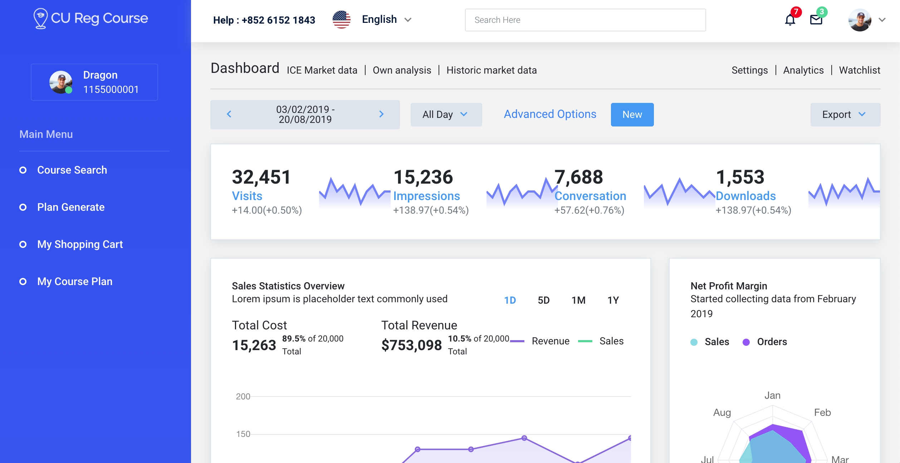

<h1>CSCI3100-Group12</h1>

Group12 project for CUHK CSCI3100 course

<h2>Dependency</h2>

- MySQL server
- Node.js
- Express - install with command: `npm install express`
- Express sessions - install with command: `npm install express-session`
- MySQL for Node.js - install with command: `npm install mysql`

<h2>Credits</h2>

- [StarAdmin Bootstrap Template](https://github.com/BootstrapDash/StarAdmin-Free-Bootstrap-Admin-Template)
- [jquery week calendar](https://github.com/themouette/jquery-week-calendar)
- Frontend: jQuery
- Backend: Node.js, MySQL

<h2>Overview</h2>

1 - Start at the login page. Enter `1155000001` as username and `748211` as password.

  

2 - In the index page, you can see some templates for you to use in your design. For more UI templates,
refer to [StarAdmin Bootstrap Template](https://github.com/BootstrapDash/StarAdmin-Free-Bootstrap-Admin-Template)
which is used in this project.  

  

3 - In the course search page, click button `search` to get all the courses listed in the table.

  

4 - In the plan generation page, you can drag and put the courses.

  

5 - In the course plan page, you can see the timetable with courses in shopping cart drawn on it.

<h2>Get started</h2>

Make sure you have fetched the `login` directory and `cusisdb-beta.sql`, installed all the
dependencies and run `npm init` in your project directory. If you are not familiar with 
npm, you may refer to [this tutorial](https://codeshack.io/basic-login-system-nodejs-express-mysql/).
  The beta version uses `cusisdbBeta` database created by `cusisdb-beta.sql`.
Remember to change the database connection settings (username, password) in the `login.js`.
  run `npm login.js`.

<h2>Updates</h2>

- 2020-04-13
 
Upload the project frontend and backend framework.
 
Update README.MD.
 
Now, the course search module can only search by keyword. No filter
or ranking is implemented. The plan generate module allows users to
drag and pull the courses. The calendar automatically loads courses
in user's shopping cart into it.

<h2>Todo list</h2>

Please keep the style consistent. The top navigation bar and
left slider is common in every pages.  

<h3> User module</h3>

<h4> Login </h4>

- User registration
- Unsuccessful login redirection

<h4>User information</h4>

- Avatar
- Preference

<h3>Course search module </h3>

<h4>Search </h4>

- Course ID/Course abbr.
- Course Name
- Department
- Lecturer
- *realtime feedback 
- *adaptive search

<h4>Filter</h4>

- Enrolled/Passed Courses
- Duplicated Courses
- Shopping Cart Courses
- Time Clash Courses
- pre/co-requisite

<h4>Ranking</h4>

- default: course code
- student remark
- credit
- vacancy
- popularity
- `f(vacancy, popularity)`

<h3>Plan Generate Module</h3>

- plan priority: `f(weight, time)`
- weight: customized

<h3>*Course recommendation module</h3>

- category: major, elective, UG, minor
- faculty package
- pattern matching (major course / minor)
- remark/voting (elective course / UG course)

