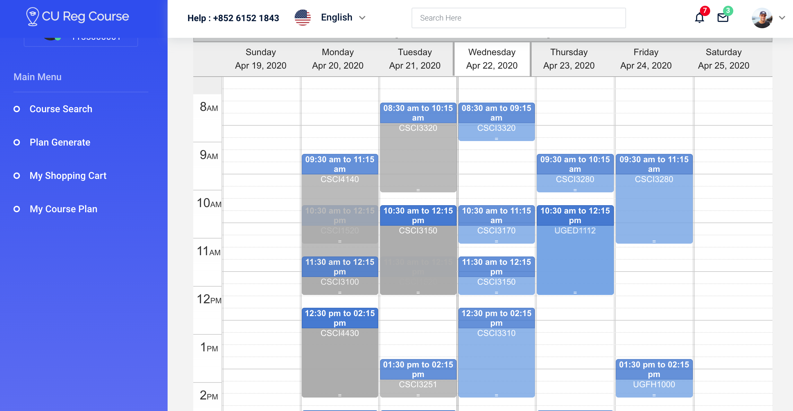

<h1>CSCI3100-Group12 CU Register Course Assistant</h1>

CUHK CSCI3100 Group12 course project

<h2>Project Structure</h2>

```bash
├── README.md
├── cusis-beta.sql
├── login
│   ├── css
│   ├── fonts
│   ├── images
│   ├── js              This is the folder where we put our js files.
│   ├── login.html      HTML file for login page.
│   ├── login.js        This file contains entry point of the App and processes Get/POST requests.
│   ├── pages           This is the folder where we put our HTML files.
│   └── vendor          3rd-party projects.
├── pastdoc             This folder contains deprecated files.
│   ├── Insert\ new\ data
│   ├── course.sql
│   ├── cu-course.sql
│   ├── cusisdbBeta_alternative_course.sql
│   ├── cusisdbBeta_course_history.sql
│   ├── cusisdbBeta_required_course.sql
│   ├── cusisdbBeta_user.sql
│   ├── shoppingcart.sql
│   └── user.sql
└── screenshot          This folder contains screenshots shown in README.MD
    ├── ss-course-plan.png
    ├── ss-course-search.png
    ├── ss-index.png
    ├── ss-login.png
    ├── ss-plan-generate.png
    └── ss-shopping-cart.png
```

<h2>Dependency</h2>

- MySQL server
- Node.js
- User from mainland needs to use VPN as the host of e-mail sender is gmail
- Express - install with command: `npm install express`
- Express sessions - install with command: `npm install express-session`
- MySQL for Node.js - install with command: `npm install mysql`
- E-mail settings for Node.js - install with these command: `npm install nodemailer`, `npm install ejs`, `npm install fs`, `npm install path`
- Random - install with command : `npm install string-random`

<h2>Credits</h2>

- [StarAdmin Bootstrap Template](https://github.com/BootstrapDash/StarAdmin-Free-Bootstrap-Admin-Template)
- [jquery week calendar](https://github.com/themouette/jquery-week-calendar)
- [Login V2](https://colorlib.com/wp/template/login-form-v2/)
- [Send e-mail through Node.js](https://github.com/liuxing/node-abc/tree/master/lesson10)
- Frontend: jQuery
- Backend: Node.js, MySQL

<h2>Overview</h2>

1 - Start at the login page. Enter `1155000001` as username and `748211` as password.

<br><br>

2 - In the course search page, click button `search` to get all the courses listed in the table.
Click `Add` or `Remove` to add/remove courses to/from shopping cart. Click on the table to see
detailed information. Click on the table head to sort. You can also sort course by Ranking, or use Filter to filter unwanted result.

<br><br>

3 - In the plan generation page, you can drag and put the cou rses. Click on `Get Plan` to generate
course plan in which no time conflicts exist.

<br><br>

4 - In the shopping cart page, you can see the timetable with courses in shopping cart drawn on it.

<br><br>

5 - In the course plan page, you can see the timetable with courses in course plan drawn on it.


<h2>Get started</h2>

Make sure you have fetched the `login` directory and `cusisdb-beta.sql`, installed all the
dependencies and run `npm init` in your project directory. If you are not familiar with 
npm, you may refer to [this tutorial](https://codeshack.io/basic-login-system-nodejs-express-mysql/).
<br><br>The beta version uses `cusisdbBeta` database created by `cusisdb-beta.sql`.
Remember to change the database connection settings (username, password) in the `login.js`.
<br><br>run `npm login.js`.

<h2>Updates</h2>

- 2020-04-24 <br>
After signing out, user's information are all cleared. <br>

- 2020-04-22 <br>
Implement Ranking. <br>
Implement Filters.

- 2020-04-21 <br>
Implement plan generation. <br>
Implement course search dropdown.<br>
Implement user registration.

- 2020-04-16 <br>
In course search page, support add/remove course to/from shopping cart.
Implement sorting by attribute.

- 2020-04-13 <br>
Upload the project frontend and backend framework.<br>
Update README.MD.<br>
Now, the course search module can only search by keyword. No filter
or ranking is implemented. The plan generate module allows users to
drag and pull the courses. The calendar automatically loads courses
in user's shopping cart into it.
